# Architecture

Technical overview of IRFlow Timeline's architecture for developers and contributors.

## System Architecture

```mermaid
graph TB
    subgraph Renderer["React UI Layer — src/App.jsx"]
        direction LR
        Grid["Virtual Scrolling Grid"]
        Search["Search & Filtering"]
        Analytics["Analytics Visualizations"]
        State["State: 40+ useState hooks"]
    end

    subgraph Main["Electron Main Process — main.js"]
        direction LR
        IPC_H["44 IPC Handlers"]
        Dialogs["File Dialogs & Native Menus"]
        Session["Session Management"]
        Export["Export Orchestration"]
    end

    subgraph DB["SQLite Data Engine — db.js"]
        direction LR
        TDB["TimelineDB Class\n40+ methods"]
        FTS["FTS5 Full-Text Search"]
        Funcs["Custom Functions\nREGEXP · FUZZY_MATCH\nEXTRACT_DATE"]
        Analyze["Analytics\nHistogram · Process Tree\nLateral Movement\nPersistence Analyzer"]
    end

    subgraph Parser["Parser Layer — parser.js"]
        direction LR
        CSV["CSV/TSV\n128MB chunks"]
        XLSX["XLSX\nExcelJS streaming"]
        XLS["XLS\nSheetJS legacy"]
        EVTX["EVTX\n@ts-evtx binary"]
        Plaso["Plaso\nSQLite direct query"]
    end

    Renderer -->|"IPC · contextBridge"| Main
    Main -->|"Sync / Async API"| DB
    DB -->|"Streaming I/O"| Parser

    style Renderer fill:#1a1e2e,stroke:#E85D2A,stroke-width:2px,color:#e6edf3
    style Main fill:#1a1e2e,stroke:#58a6ff,stroke-width:2px,color:#e6edf3
    style DB fill:#1a1e2e,stroke:#3fb950,stroke-width:2px,color:#e6edf3
    style Parser fill:#1a1e2e,stroke:#d29922,stroke-width:2px,color:#e6edf3
```



## Layer Responsibilities

### Renderer Process (React)

**File:** `src/App.jsx` (~9,052 lines) + `src/detection-rules.js` (~380 lines)

The renderer runs in a sandboxed browser context with no direct Node.js access. All system operations go through the IPC bridge.

Responsibilities:
- Grid rendering with virtual scrolling
- User interaction handling
- State management (React hooks)
- Visualization rendering (histogram, process tree, lateral movement graphs)
- Theme management (dark/light)

### Preload Bridge

**File:** `preload.js` (~95 lines)

The preload script creates a secure bridge between the renderer and main process using Electron's `contextBridge` API. It exposes a controlled set of IPC methods as `window.electronAPI`.

### Main Process (Electron)

**File:** `main.js` (~1,132 lines)

The main process runs with full Node.js access and manages:
- Window lifecycle and native menus
- IPC handler registration (44 handlers)
- File dialog management
- Export orchestration (CSV, XLSX, HTML)
- Session save/load coordination
- macOS integration (vibrancy, dark mode, traffic lights)

### Data Engine (SQLite)

**File:** `db.js` (~3,950 lines)

The `TimelineDB` class wraps `better-sqlite3` with forensic-analysis-specific operations:

**Schema per tab:**
```sql
CREATE TABLE data (rowid INTEGER PRIMARY KEY, c0 TEXT, c1 TEXT, ...);
CREATE VIRTUAL TABLE data_fts USING fts5(c0, c1, ..., content=data);
CREATE TABLE bookmarks (rowid INTEGER PRIMARY KEY);
CREATE TABLE tags (rowid INTEGER, tag TEXT, PRIMARY KEY(rowid, tag));
CREATE TABLE color_rules (id, col_name, condition, value, bg_color, fg_color);
```

**Custom SQL functions:**
- `REGEXP(pattern, value)` — deterministic regex matching
- `FUZZY_MATCH(text, term)` — n-gram similarity for typo tolerance
- `EXTRACT_DATE(value)` — normalize any timestamp to `yyyy-MM-dd`
- `EXTRACT_DATETIME_MINUTE(value)` — normalize to `yyyy-MM-dd HH:mm`

**Performance tuning (phase-dependent):**
- Import: `journal_mode=OFF`, 1GB cache, 64KB pages, `threads=4`
- Index/FTS build: `journal_mode=OFF`, 1GB cache, `threads=8`
- Query: WAL mode, 256MB cache, 512MB MMAP
- Exclusive locking throughout (single-user optimization)
- All columns indexed asynchronously after import

### Parser Layer

**File:** `parser.js` (~1,094 lines)

Streaming parsers convert source files into SQLite batch inserts:

- **CSV:** 128MB chunk reader, RFC 4180 compliant, auto-delimiter detection
- **XLSX:** ExcelJS `WorkbookReader` for memory-efficient streaming
- **XLS:** SheetJS in-memory reader for legacy binary Excel format
- **EVTX:** `@ts-evtx` binary parsing with dynamic schema discovery
- **Plaso:** Direct SQLite query via `better-sqlite3`

## Data Flow

### Import Pipeline

```
File → Parser (streaming chunks) → Batch Arrays → SQLite INSERT
                                    (50K rows)     (prepared statements)
```

1. Parser reads file in chunks (128MB for CSV)
2. Rows are accumulated into adaptive batches (up to 100,000 rows, tuned by column count)
3. Batches are inserted using pre-built multi-row INSERT statements with pre-allocated parameter arrays
4. Progress callbacks update the UI every 200ms (time-based)
5. After import: type detection, then async background builds (column indexes → FTS5 index)

### Query Pipeline

```
UI Action → IPC → db.queryRows() → SQL Query → Result Set → IPC → Grid Render
              ↓                        ↓
         Debounce (500ms)       LIMIT/OFFSET
                                 (pagination)
```

1. User scrolls, searches, or filters
2. Request is debounced (500ms for search/filter)
3. SQL query is built with active filters, sort, and pagination
4. Results (up to 5,000 rows) returned via IPC
5. Grid renders visible rows from the cached window

## Technology Stack

| Technology | Version | Purpose |
|-----------|---------|---------|
| **Electron** | ^33.2.1 | Native app container |
| **React** | ^18.3.1 | UI framework |
| **Vite** | ^6.0.7 | Build tooling |
| **better-sqlite3** | ^11.7.0 | SQLite bindings (zero-copy) |
| **ExcelJS** | ^4.4.0 | XLSX streaming |
| **SheetJS (xlsx)** | ^0.18.5 | Legacy XLS parsing |
| **@ts-evtx** | ^1.1.1 | EVTX binary parsing |
| **csv-parser** | ^3.0.0 | CSV parsing |
| **electron-builder** | ^25.1.8 | App packaging |

## Build Targets

| Target | Command | Output |
|--------|---------|--------|
| **Development** | `npm run dev` | Vite + Electron hot reload |
| **Quick start** | `npm run start` | Build + run |
| **DMG** | `npm run dist:dmg` | macOS installer |
| **Universal** | `npm run dist:universal` | Intel + Apple Silicon |

## Security Model

- **Context isolation** enabled — renderer has no Node.js access
- **Preload bridge** exposes only whitelisted IPC methods
- **No remote content** — purely local data processing
- **Hardened runtime** enabled for macOS distribution
- **No network requests** — all processing is offline
